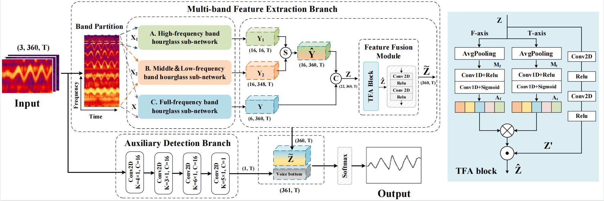
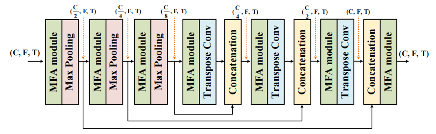
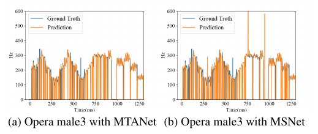
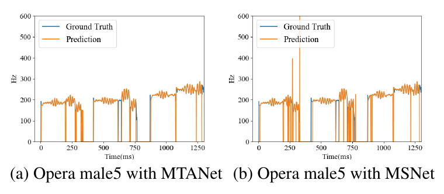
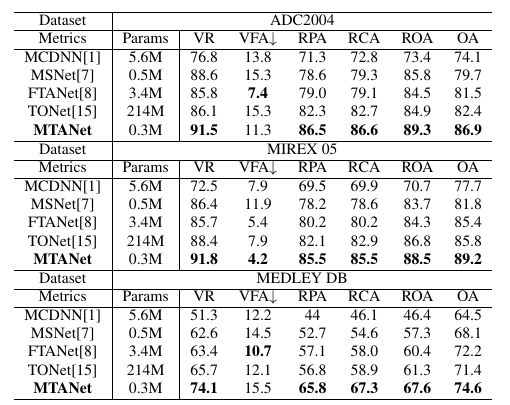
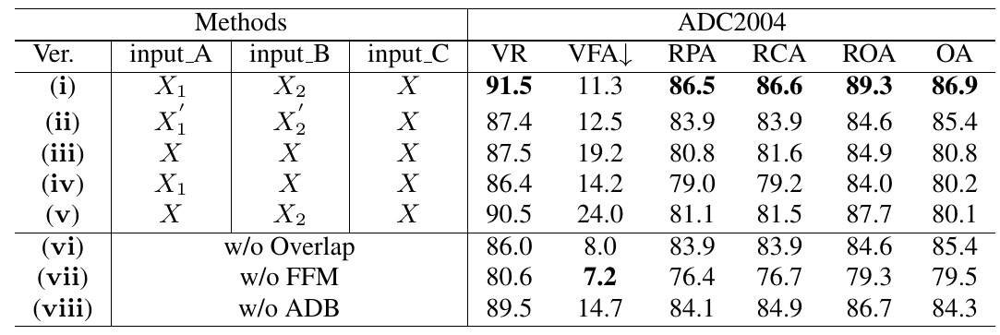

# MTANet

## Introduction

The official implementation of "MTANET: Multi-band Time-frequency attention Network for Singing Melody Extraction from Polyphonic Music.

We propose a more powerful singing melody extractor named multi-band time-frequency attention network (MTANet) for polyphonic music. Experimental results show that our proposed MTANet achieves promising performance compared with existing state-of-the-art methods, while keeping with a small number of network parameters.

## Important updata

(i) Due to the author's mistake, Figure 3 in the manuscript of the paper shows an earlier version, which may cause some misunderstandings for reviewers and readers. I am very sorry for this situation! The following picture is the revised version for reference and I will make formal corrections in the subsequent manuscript.

(ii) Rename the MMNet to the MTANet.

## Getting Started

### Download Datasets

* [MIR-1k](https://sites.google.com/site/unvoicedsoundseparation/mir-1k)
* [ADC 2004 & MIREX05](https://labrosa.ee.columbia.edu/projects/melody/)
* [MedleyDB](https://medleydb.weebly.com/)

After downloading the data, use the txt files in the data folder, and process the CFP feature by [feature_extraction.py](feature_extraction.py).

## Model implementation

Refer to the file: [mtanet.py](model/mtanet.py)

The model code has been uploaded and the rest of code will be released soon ...

## Result

### Prediction result

The visualization illustrates that our proposed MTANet can reduce the octave errors and the melody detection errors.

### Comprehensive result

The scores here are either taken from their respective papers or from the result implemented by us. Experimental results show that our proposed MTANet achieves promising performance compared with existing state-of-the-art methods.

### Ablation study result

we conducted seven ablations to verify the effectiveness of each design in the proposed network. Due to the page limit, we selected the ADC2004 dataset for ablation study in the paper. More detailed results are presented here.

## Download the pre-trained model

Refer to the contents of the folder: pre-train model
